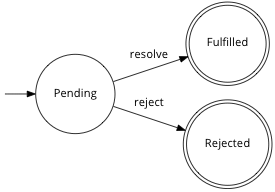

# pacta [](https://travis-ci.org/mudge/pacta)

```javascript
{ 'pacta': '0.5.1' }
```

```shell
$ npm install pacta   # for node
$ bower install pacta # for the browser
```

This is an implementation of [algebraic][Fantasy Land], [Promises/A+][A+]
compliant Promises in JavaScript (both for the browser and
[node.js](http://nodejs.org)).

Promises can be thought of as objects representing a value that may not have
been calculated yet (they are sometimes referred to as `Deferred`s).

An obvious example is the result of an asynchronous HTTP request: it's not
clear *when* the request will be fulfilled but it will be at some point in the
future. Having actual Promise objects representing these eventual values
allows you to compose, transform and act on them without worrying about their
time or sequence of execution.

At their most basic, an empty promise can be created and resolved like so:

```javascript
/* Include pacta.js or require explicitly in node.js: */
var Promise = require('pacta');

var p = new Promise();
setTimeout(function () {

  /* Populate the promise with its final value. */
  p.resolve(1);
}, 1000);
```

Promises can also be marked as `rejected` (viz. represent an error state) like
so:

```javascript
/* Mark the promise as rejected with a reason. */
p.reject('The server could not be found.');
```

Concretely, a promise can be represented by the following deterministic finite automaton:

<p align="center"></p>

For a worked example of using promises, see the
[two](https://github.com/mudge/pacta/blob/master/example/codenames.js)
[example
programs](https://github.com/mudge/pacta/blob/master/example/codenames-2.js)
and [sample HTTP
client](https://github.com/mudge/pacta/blob/master/example/promised-http.js)
included in Pacta.

Pacta's promises can be used as the following algebraic structures as defined
in the [Fantasy Land
Specification][Fantasy Land]:

* [Semigroups](https://github.com/puffnfresh/fantasy-land#semigroup) (through
  [`Promise#concat`](#promiseconcatp) which concatenates promises containing semigroups such as
  arrays and strings);
* [Monoids](https://github.com/puffnfresh/fantasy-land#monoid) (through
  [`Promise#empty`](#promiseempty) which returns an empty version of a promise that contains a
  monoid);
* [Functors](https://github.com/puffnfresh/fantasy-land#functor) (through
  [`Promise#map`](#promisemapf));
* [Applicative](https://github.com/puffnfresh/fantasy-land#applicative)
  (through [`Promise#ap`](#promiseapp) and [`Promise.of`](#promiseofx));
* [Chains](https://github.com/puffnfresh/fantasy-land#chain) (through [`Promise#chain`](#promisechainf));
* [Monads](https://github.com/puffnfresh/fantasy-land#monad) (through all of
  the above).

Pacta's promises are compliant with the [Promises/A+
specification](http://promises-aplus.github.io/promises-spec), providing
a [`then` method](#promisethenonfulfilled-onrejected).

Promises are resolved (or fulfilled) with
[`Promise#resolve`](#promiseresolvex) and rejected with
[`Promise#reject`](#promiserejectreason).

To execute code on rejection without using
[`Promise#then`](#promisethenonfulfilled-onrejected), use
[`Promise#onRejected`](#promiseonrejectedf).

Pacta also provides the following functions for creating and working with
Promises of lists:

* [`Promise#conjoin`](#promiseconjoinp) to concatenate promises into a list of
  values regardless of their original type meaning that non-Monoid types can
  be combined with others (e.g. a promise of `'foo'` can be conjoined with
  `[1, 2]` to produce `['foo', 1, 2]`);
* [`Promise#append`](#promiseappendp) to append promises to an initial promise
  of a list. This means that you can work more easily with multiple promises
  of lists without joining them together (as would be done with `concat` and
  `conjoin`), e.g.  appending a promise of `[2, 3]` to a promise of `[1]`
  results in `[1, [2, 3]]` rather than `[1, 2, 3]`);
* [`Promise#reduce`](#promisereducef-initialvalue) to
  [reduce](https://developer.mozilla.org/en-US/docs/JavaScript/Reference/Global_Objects/Array/Reduce)
  a list within a promise;
* [`Promise#spread`](#promisespreadf) to map over a promise's value but,
  instead of receiving a single value, spread the promise's value across
  separate arguments:

```javascript
Promise.of([1, 2]).spread(function (x, y) {
  console.log(x); //=> 1
  console.log(y); //=> 2
});
```

It also defines a monoid interface for `Array` and `String`, implementing
`empty` such that:

```javascript
Array.empty();  //=> []
String.empty(); //=> ""
```

See [the test
suite](https://github.com/mudge/pacta/blob/master/test/pacta_test.js) for more
information.

[A+]: http://promises-aplus.github.io/promises-spec/
[Fantasy Land]: https://github.com/puffnfresh/fantasy-land
[Maybe]: https://en.wikipedia.org/wiki/Monad_(functional_programming)#The_Maybe_monad

## Usage

```javascript
var Promise = require('pacta');

var p = new Promise();
setTimeout(function () {
  p.resolve('Foo');
}, 1000);

p.map(console.log); //=> "Foo"

p.map(function (x) {
  return x + '!';
}).map(console.log); //=> "Foo!"

var p2 = new Promise();
setTimeout(function () {
  p2.resolve(['bar']);
}, 500);

var p3 = Promise.of(['baz']);

p2.concat(p3).map(console.log); //=> [ 'bar', 'baz' ]

p.conjoin(p2).map(console.log); //=> [ 'Foo', 'bar' ]

Promise.of([]).append(p).append(p2).map(console.log);
//=> [ 'Foo', [ 'bar' ] ]

p2.append(p).spread(function (x, y) {
  console.log(x); //=> 'bar'
  console.log(y); //=> 'Foo'
});

var p4 = new Promise();
setTimeout(function () {
  p4.reject('Error!');
}, 1000);

p4.onRejected(function (reason) {
  console.error('Failed due to', reason);
}); //=> Failed due to Error!

p4.then(function (value) {
  console.log('Success!', value);
}, function (reason) {
  console.error('Failure!', reason);
}); //=> Failure! Error!
```

## API Documentation

### `Promise()`

```javascript
var promise = new Promise();
```

Create a new, unfulfilled promise that will eventually be populated with a
value (through [`resolve`](#promiseresolvex)).

### `Promise.of(x)`

```javascript
var promise = Promise.of(1);
var promise = Promise.of('foo');
```

Create a new, fulfilled promise already populated with a value `x`.

### `Promise#resolve(x)`

```javascript
var promise = new Promise();
promise.resolve(5);
```

Populate a promise with the value `x` thereby resolving it.

*This function can also be called as `Promise#fulfill`.*

### `Promise#reject(reason)`

```javascript
var promise = new Promise();
promise.reject('Errored out!');
```

Mark a promise as rejected, populating it with a reason.

### `Promise#map(f)`

```javascript
var promise = Promise.of(2);

promise.map(function (x) {
  console.log(x);

  return x * 2;
}); //=> Promise.of(4)

promise.map(function (x) {
  return Promise.of(x * 2);
}); //=> Promise.of(Promise.of(4))
```

Execute a function `f` on the contents of the promise. This returns a new
promise containing the result of applying `f` to the initial promise's value.

In [Haskell](http://www.haskell.org) notation, its type signature is:

```haskell
map :: Promise e a -> (a -> b) -> Promise e b
```

Note that this is the primary way of acting on the value of a promise: you can
use side-effects within your given function (e.g. `console.log`) as well as
modifying the value and returning it in order to affect the returning
promise.

Note that any uncaught exceptions during the execution of `f` will result in
the promise being `rejected` with the exception as its `reason`.

### `Promise#mapError(f)`

```javascript
var promise = new Promise();
promise.reject('Type error at line 214');

promise.mapError(function (x) {
  console.log(x);

  return 'Error: ' + x;
}); //=> Rejected promise with "Error: Type error at line 214" as reason
```

Execute a function `f` on the reason of a rejected promise. This returns a new
rejected promise containing the result of applying `f` to the initial
promise's reason.

In [Haskell](http://www.haskell.org) notation, its type signature is:

```haskell
mapError :: Promise e a -> (e -> f) -> Promise f a
```

Note that any uncaught exceptions during the execution of `f` will result in
the promise being `rejected` with the exception as its `reason`.

### `Promise#then([onFulfilled[, onRejected]])`

```javascript
promise.then(function (value) {
  return x * 2;
}); //=> Promise.of(4)

promise.then(function (value) {
  return Promise.of(x * 2);
}); //=> Promise.of(4)

promise.then(function (value) {
  console.log('Success!', value);
}, function (reason) {
  console.error('Error!', reason);
});
```

An implementation of the [Promises/A+ `then`
method](http://promisesaplus.com/#the__method), taking an
optional `onFulfilled` and `onRejected` function to call when the promise is
fulfilled or rejected respectively.

Like [`Promise#map`](#promisemapf), `then` returns a promise itself and can be
chained.

### `Promise#onRejected(f)`

```javascript
var p = new Promise();
p.reject('Error!');
p.onRejected(function (reason) {
  console.error('Failed:', reason);
});
```

Identical to [`Promise#map`](#promisemapf) but only executed when a promise is
rejected rather than resolved.

Note that `onRejected` returns a promise itself that is fulfilled by the given
function, `f`. In this way, you can gracefully recover from errors like so:

```javascript
var p = new Promise();
p.reject('Error!');

p.onRejected(function (reason) {
  return 'Some safe default';
}).map(console.log);
//=> Logs "Some safe default"
```

Like [`Promise#map`](#promisemapf), any uncaught exceptions within `f` will
result in a `rejected` promise:

```javascript
var p = new Promise();
p.reject('Error!');

p.onRejected(function (reason) {
  throw 'Another error!';
}).onRejected(console.log);
//=> Logs "Another error!"
```

### `Promise#concat(p)`

```javascript
var promise = Promise.of('foo'),
    promise2 = Promise.of('bar');

promise.concat(promise2); //=> Promise.of('foobar')
```

Concatenate the promise with another promise `p` into one containing both
values concatenated together. This will work for any promise containing a
semigroup (viz. a value that supports `concat`) such as `String` or `Array`.
Note that [`concat`'s usual
behaviour](https://developer.mozilla.org/en-US/docs/JavaScript/Reference/Global_Objects/Array/concat)
of joining arrays, etc. applies.

Its type signature is:

```haskell
concat :: Promise e a -> Promise e a -> Promise e a
```

If either of the original two promises is rejected, the resulting concatenated
promise will also be rejected. Note that only the first rejection will count
as further rejections will be ignored.

See also [`Promise#conjoin`](#promiseconjoinp) and
[`Promise#append`](#promiseappendp).

### `Promise#chain(f)`

```javascript
var promise = Promise.of(2);

promise.chain(function (x) { return Promise.of(x * 2); }); //=> Promise.of(4)
```

Execute a function `f` with the value of the promise. This differs from
[`Promise#map`](#promisemapf) in that the function *must* return a promise
itself.

Its type signature is:

```haskell
chain :: Promise e a -> (a -> Promise e b) -> Promise e b
```

### `Promise#chainError(f)`

```javascript
var criticalAjaxCallThatMayFail = function() {
    var p = new Promise();

    setTimeout(function () {
        if (Date.now() % 2 === 0) {
            p.reject('Request timed out');
        } else {
            p.resolve('This is a critical sentence.');
        }
    }, 2000);

    return p;
};

var getMessage = function (error) {
    if (error) {
        console.error('Error received: ' + error);
        console.log('Retrying...');
    }

    console.log('Sending request...');
    return criticalAjaxCallThatMayFail();
};

/* Retry 2 times if it fails */
getMessage()
    .chainError(getMessage)
    .chainError(getMessage)
    .map(console.log)
    .mapError(console.error);
```

Execute a function `f` with the reason of a rejected promise. This differs
from [`Promise#mapError`](#promisemaperrorf) in that the function *must*
return a promise itself.

Its type signature is:

```haskell
chainError :: Promise e a -> (e -> Promise f a) -> Promise f a
```

### `Promise#ap(p)`

```javascript
var promise = Promise.of(function (x) { return x * 2; }),
    promise2 = Promise.of(2);

promise.ap(promise2); //=> Promise.of(4)
```

On a promise containing a function, call that function with a promise `p`
containing a value.

Its type signature is:

```haskell
ap :: Promise e (a -> b) -> Promise e a -> Promise e b
```

### `Promise#empty()`

```javascript
var promise = Promise.of('woo');

promise.empty(); //=> Promise.of('')
```

On a promise containing a monoid (viz. something with an `empty()` function on
itself or its constructor like `Array` or `String`), return a new promise with
an empty version of the initial value.

(Pacta ships with Monoid implementations for `Array` and `String` by default.)

### `Promise#conjoin(p)`

```javascript
var promise = Promise.of(1),
    promise2 = Promise.of([2, 3]);

promise.conjoin(promise2); //=> Promise.of([1, 2, 3])
```

Conjoin the promise with another promise `p`, converting their values to
arrays if needed (e.g. `'foo'` into `['foo']`). This differs from
[`Promise#concat`](#promiseconcatp) which only works on promises of values
that are semigroups themselves.

All values are coerced to arrays using `[].concat`.

### `Promise#append(p)`

```javascript
var promise = Promise.of([]),
    promise2 = Promise.of([1]);

promise.append(promise2); //=> Promise.of([[1]])
```

On a promise of a list, append another promise `p`'s value to it without
joining (e.g. appending `[1]` to `[]` results in `[[1]]`).

This is particularly useful when dealing with several promises containing
lists and you want to keep them separated instead of being merged into one as
would happen with [`Promise#concat`](#promiseconcatp) and
[`Promise#conjoin`](#promiseconjoinp).

### `Promise#reduce(f[, initialValue])`

```javascript
var promise = Promise.of([1, 2, 3]);

promise.reduce(function (acc, e) {
  return acc + e;
}, 0); //=> Promise.of(6)
```

On a promise containing an array,
[reduce](https://developer.mozilla.org/en-US/docs/JavaScript/Reference/Global_Objects/Array/Reduce)
its value, returning a promise of the resulting value. This defers to the
underlying signature of `reduce` taking a function `f` and an optional
`initialValue`.

### `Promise#spread(f)`

```javascript
var promise = Promise.of([1, 2]);

promise.spread(function (x, y) {
  return x + y;
}); //=> Promise.of(3)
```

Similar to [`Promise#map`](#promisemapf), apply a function `f` to a promise of
a list but, instead of receiving a single argument, pass each value of the
list to the function separately.

## Contributors

* Fixes to `chain`, `chainError` and `empty` were contributed by [Ben
  Schulz](https://github.com/benschulz);
* `mapError` and `chainError` were contributed by [Rodolphe
  Belouin](https://github.com/rbelouin).

## Acknowledgements

[James
Coglan](http://blog.jcoglan.com/2013/03/30/callbacks-are-imperative-promises-are-functional-nodes-biggest-missed-opportunity/)
and [Aanand Prasad](http://aanandprasad.com/articles/negronis/) convinced me
to explore the idea of monadic promises and [Brian McKenna's "Fantasy Land"
specification](https://github.com/puffnfresh/fantasy-land) and
[feedback](https://github.com/mudge/pacta/issues/1) were essential.

[][Fantasy Land] [][A+]

## License

Copyright © 2013 Paul Mucur.

Distributed under the MIT License.

